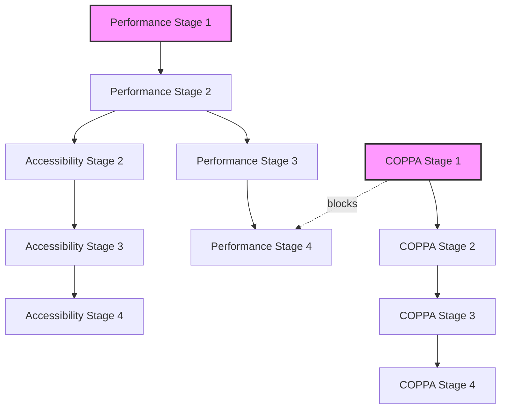

# Process Implementation Tracker
## Minecraft Skin Studio Critical Objectives

---

## EXECUTIVE SUMMARY

This tracker monitors the implementation of three critical development processes:
1. **Performance Optimization** - Achieving 60+ FPS
2. **Accessibility Implementation** - WCAG AA Compliance  
3. **COPPA Compliance** - Child privacy protection

**Current Status:** NOT STARTED  
**Target Completion:** [TBD]  
**Risk Level:** HIGH - Multiple critical objectives pending

---

## PROCESS 1: PERFORMANCE OPTIMIZATION (PROC-PERF-001)

### Overall Progress: 0%

| Stage | Status | Progress | Start Date | End Date | Owner | Blockers |
|-------|--------|----------|------------|----------|-------|----------|
| Stage 1: Baseline Measurement | NOT STARTED | 0% | - | - | Performance Engineer | None |
| Stage 2: Canvas Optimization | NOT STARTED | 0% | - | - | Frontend Developer | Depends on Stage 1 |
| Stage 3: Dirty Rectangle | NOT STARTED | 0% | - | - | Graphics Engineer | Depends on Stage 2 |
| Stage 4: Validation Gates | NOT STARTED | 0% | - | - | QA Lead | Depends on Stage 3 |

### Key Metrics
- **Current FPS:** Unknown (needs baseline)
- **Target FPS:** 60+
- **Memory Usage:** Unknown
- **Frame Drop Rate:** Unknown

### Test Results
```yaml
automated_tests:
  total: 0
  passed: 0
  failed: 0
  skipped: 0
  
performance_benchmarks:
  chrome: NOT_TESTED
  firefox: NOT_TESTED
  safari: NOT_TESTED
  edge: NOT_TESTED
```

### Risk Assessment
- **Technical Debt:** Canvas implementation may need major refactoring
- **Browser Compatibility:** Different performance across browsers
- **Hardware Variance:** Lower-end devices may struggle

---

## PROCESS 2: ACCESSIBILITY IMPLEMENTATION (PROC-A11Y-001)

### Overall Progress: 0%

| Stage | Status | Progress | Start Date | End Date | Owner | Blockers |
|-------|--------|----------|------------|----------|-------|----------|
| Stage 1: Component Audit | NOT STARTED | 0% | - | - | Accessibility Specialist | None |
| Stage 2: ARIA Implementation | NOT STARTED | 0% | - | - | Frontend Developer | Depends on Stage 1 |
| Stage 3: Keyboard Navigation | NOT STARTED | 0% | - | - | UX Developer | None |
| Stage 4: Screen Reader Testing | NOT STARTED | 0% | - | - | QA Accessibility Tester | Depends on Stage 2&3 |

### Compliance Checklist
- [ ] **Perceivable**
  - [ ] Text alternatives for non-text content
  - [ ] Captions and other alternatives for multimedia
  - [ ] Content can be presented in different ways
  - [ ] Make it easier for users to see and hear content

- [ ] **Operable**
  - [ ] All functionality available from keyboard
  - [ ] Users have enough time to read content
  - [ ] Content doesn't cause seizures
  - [ ] Users can navigate and find content

- [ ] **Understandable**
  - [ ] Text is readable and understandable
  - [ ] Web pages appear and operate predictably
  - [ ] Users are helped to avoid and correct mistakes

- [ ] **Robust**
  - [ ] Content compatible with assistive technologies
  - [ ] Content remains accessible as technologies advance

### Accessibility Score
```yaml
current_score:
  level: UNKNOWN
  violations:
    critical: UNKNOWN
    serious: UNKNOWN
    moderate: UNKNOWN
    minor: UNKNOWN
    
wcag_compliance:
  level_a: NOT_EVALUATED
  level_aa: NOT_EVALUATED
  
screen_reader_support:
  nvda: NOT_TESTED
  jaws: NOT_TESTED
  voiceover: NOT_TESTED
```

---

## PROCESS 3: COPPA COMPLIANCE (PROC-COPPA-001)

### Overall Progress: 0%

| Stage | Status | Progress | Start Date | End Date | Owner | Blockers |
|-------|--------|----------|------------|----------|-------|----------|
| Stage 1: Age Verification | NOT STARTED | 0% | - | - | Security Engineer | None |
| Stage 2: Parental Consent | NOT STARTED | 0% | - | - | Full-Stack Developer | Depends on Stage 1 |
| Stage 3: Parent Dashboard | NOT STARTED | 0% | - | - | Frontend Developer | Depends on Stage 2 |
| Stage 4: Compliance Validation | NOT STARTED | 0% | - | - | Legal Compliance Officer | Depends on All |

### Compliance Requirements
- [ ] **Notice Requirements**
  - [ ] Privacy policy posted
  - [ ] Direct notice to parents
  - [ ] Information collected disclosed
  - [ ] Use of information explained

- [ ] **Parental Consent**
  - [ ] Verifiable consent mechanism
  - [ ] Consent before collection
  - [ ] Consent exceptions documented
  - [ ] Revocation process available

- [ ] **Parental Access**
  - [ ] Parents can review child's data
  - [ ] Parents can delete child's data
  - [ ] Parents can refuse further collection
  - [ ] Access request process documented

- [ ] **Data Security**
  - [ ] Reasonable security measures
  - [ ] Data retention limits
  - [ ] Deletion procedures
  - [ ] Third-party disclosure controls

### Legal Status
```yaml
legal_review:
  status: NOT_STARTED
  findings: []
  approval: PENDING
  
compliance_audit:
  last_audit: NEVER
  findings: []
  score: 0
  certification: NONE
```

---

## INTEGRATION STATUS

### Cross-Process Dependencies


### Release Readiness

| Criterion | Status | Required | Current |
|-----------|--------|----------|---------|
| Performance FPS | ❌ NOT MET | 60+ | Unknown |
| WCAG AA Compliance | ❌ NOT MET | 100% | 0% |
| COPPA Compliance | ❌ NOT MET | 100% | 0% |
| Security Audit | ❌ NOT DONE | PASSED | None |
| User Acceptance | ❌ NOT DONE | 90%+ | 0% |

**Release Decision:** ❌ **BLOCKED**

---

## ACTION ITEMS

### Immediate Actions (P0)
1. **Assign Process Owners**
   - [ ] Identify Performance Engineer
   - [ ] Identify Accessibility Specialist
   - [ ] Identify Security Engineer
   - [ ] Identify Legal Compliance Officer

2. **Setup Infrastructure**
   - [ ] Performance monitoring tools
   - [ ] Accessibility testing tools
   - [ ] Age verification system design
   - [ ] Test environment preparation

3. **Baseline Measurements**
   - [ ] Current performance metrics
   - [ ] Current accessibility violations
   - [ ] Current data collection audit

### Next Sprint (P1)
1. Begin Performance Stage 1
2. Begin Accessibility Stage 1
3. Begin COPPA Stage 1
4. Setup continuous monitoring

### Blocked Items
- Performance validation blocked by COPPA age gate
- Full testing blocked by incomplete implementations
- Legal review blocked by implementation completion

---

## MONITORING & ALERTS

### Alert Thresholds
```yaml
performance:
  fps_drop: < 55 FPS for > 5 seconds
  memory_leak: > 10MB/minute growth
  frame_drops: > 10% frames dropped
  
accessibility:
  critical_violations: > 0
  wcag_regression: ANY
  keyboard_trap: ANY
  
compliance:
  unauthorized_access: ANY
  data_collection_violation: ANY
  consent_bypass: ANY
```

### Escalation Matrix

| Issue Type | Severity | Escalate To | Timeline |
|------------|----------|-------------|----------|
| Performance < 30 FPS | CRITICAL | Tech Lead + PM | Immediate |
| WCAG Violation (Critical) | HIGH | Accessibility Lead | Within 1 hour |
| COPPA Violation | CRITICAL | Legal + Executive | Immediate |
| Test Suite Failure | MEDIUM | QA Lead | Within 4 hours |
| Rollback Required | HIGH | All Stakeholders | Immediate |

---

## REPORTING

### Weekly Status Report
- Overall progress percentage
- Completed milestones
- Upcoming milestones
- Blockers and risks
- Resource needs

### Daily Standup Topics
- Yesterday's progress
- Today's goals
- Current blockers
- Help needed

### Sprint Review Items
- Demos of completed stages
- Metrics and measurements
- Test results summary
- Risk assessment update

---

## APPENDIX: Quick Commands

```bash
# Check current status
npm run process:status

# Run stage validation
npm run validate:stage --stage=<stage-id>

# Generate progress report
npm run report:progress

# Check dependencies
npm run check:dependencies

# Emergency rollback
npm run emergency:rollback --reason="<reason>"
```

---

**Last Updated:** 2025-08-10  
**Next Review:** Daily at 10:00 AM  
**Tracker Version:** 1.0.0  
**Auto-refresh:** Every 15 minutes