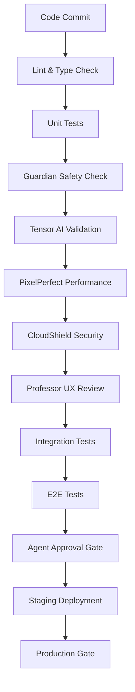

# Agent-Driven Pipeline Implementation Plan for Minecraft Skin Studio

## Executive Summary

This document outlines how to adapt the danger-rose agent-driven pipeline architecture to the Minecraft Skin Studio project, creating a comprehensive quality assurance system tailored for a child-focused, AI-integrated application.

## Proposed Agent System for Minecraft Skin Studio

### 1. Core Quality Agents

#### **Guardian** - Child Safety & COPPA Compliance Agent
**Role**: Ensures all features are child-safe and legally compliant
```yaml
Responsibilities:
  - Monitor AI responses for inappropriate content
  - Validate COPPA compliance in data handling
  - Review parental control implementations
  - Audit privacy measures
  
Standards:
  - Zero inappropriate content incidents
  - 100% COPPA compliance
  - No personal data collection from minors
  - Parent dashboard fully functional
```

#### **Tensor** - AI Integration Quality Agent
**Role**: Validates AI features and Claude API integration
```yaml
Responsibilities:
  - Test AI response appropriateness
  - Monitor response times (<3s requirement)
  - Validate voice recognition accuracy
  - Check context handling
  
Standards:
  - 100% safe AI responses
  - <3s response time (p95)
  - >85% voice recognition accuracy
  - Zero API key exposure
```

#### **PixelPerfect** - Canvas & Rendering Quality Agent
**Role**: Ensures pixel editor performance and accuracy
```yaml
Responsibilities:
  - Validate 60 FPS canvas operations
  - Test drawing tool accuracy
  - Monitor memory usage
  - Verify save/load functionality
  
Standards:
  - 60 FPS minimum during drawing
  - <100MB memory usage
  - Pixel-perfect accuracy
  - Zero data loss on save/load
```

#### **CloudShield** - Backend Security Agent
**Role**: Protects backend infrastructure and API security
```yaml
Responsibilities:
  - API authentication validation
  - Rate limiting enforcement
  - Injection attack prevention
  - Secret management audit
  
Standards:
  - Zero security vulnerabilities (high/critical)
  - 100% authenticated endpoints
  - Rate limits enforced
  - No exposed secrets
```

#### **Professor UX** - User Experience Agent
**Role**: Validates child-friendly interface and accessibility
```yaml
Responsibilities:
  - Accessibility compliance (WCAG)
  - Age-appropriate UI validation
  - Touch/mouse interaction testing
  - Error message friendliness
  
Standards:
  - WCAG AA compliance
  - 3-click maximum to any feature
  - Kid-friendly error messages
  - Works on tablets/touchscreens
```

### 2. Supporting Agents

#### **DocBot** - Documentation Agent
```yaml
Standards:
  - 100% API documentation
  - Parent guide complete
  - Child tutorial available
  - Teacher resources ready
```

#### **TestMaster** - Test Coverage Agent
```yaml
Standards:
  - 80% code coverage minimum
  - 100% coverage for safety features
  - E2E tests for critical paths
  - Performance benchmarks passing
```

#### **Captain Deploy** - Deployment & Operations Agent
```yaml
Standards:
  - Zero-downtime deployments
  - Rollback capability < 5 minutes
  - Health checks passing
  - Monitoring alerts configured
```

## Pipeline Architecture

### 1. Multi-Stage Quality Gates



### 2. Agent-Specific Pipeline Stages

```yaml
name: Minecraft Skin Studio Quality Pipeline

on:
  pull_request:
    branches: [main, develop]
  push:
    branches: [main]

jobs:
  # Stage 1: Basic Quality
  lint-and-type:
    name: Code Quality Check
    runs-on: ubuntu-latest
    steps:
      - uses: actions/checkout@v3
      - name: ESLint
        run: npm run lint
      - name: TypeScript Check
        run: npm run type-check
      - name: Prettier Check
        run: npm run format:check

  # Stage 2: Guardian - Child Safety Check
  guardian-safety-check:
    name: Guardian - Child Safety Validation
    needs: lint-and-type
    runs-on: ubuntu-latest
    steps:
      - name: Content Filter Test
        run: npm run test:safety
      - name: COPPA Compliance Scan
        run: npm run audit:coppa
      - name: Data Collection Audit
        run: npm run audit:privacy
      - name: Parental Controls Test
        run: npm run test:parental-controls
      
  # Stage 3: Tensor - AI Quality
  tensor-ai-validation:
    name: Tensor - AI Integration Check
    needs: guardian-safety-check
    runs-on: ubuntu-latest
    steps:
      - name: AI Response Safety Test
        run: npm run test:ai:safety
      - name: Response Time Benchmark
        run: npm run benchmark:ai:response
      - name: Voice Recognition Test
        run: npm run test:voice:accuracy
      - name: Context Handling Test
        run: npm run test:ai:context
        
  # Stage 4: PixelPerfect - Performance
  pixel-perfect-performance:
    name: PixelPerfect - Canvas Performance
    needs: tensor-ai-validation
    runs-on: ubuntu-latest
    steps:
      - name: FPS Benchmark
        run: npm run benchmark:canvas:fps
      - name: Memory Usage Test
        run: npm run test:memory:usage
      - name: Drawing Accuracy Test
        run: npm run test:canvas:accuracy
      - name: Save/Load Test
        run: npm run test:persistence
        
  # Stage 5: CloudShield - Security
  cloud-shield-security:
    name: CloudShield - Security Validation
    needs: pixel-perfect-performance
    runs-on: ubuntu-latest
    steps:
      - name: Security Audit
        run: npm audit --audit-level=high
      - name: OWASP Dependency Check
        run: npm run security:owasp
      - name: API Security Test
        run: npm run test:api:security
      - name: Secret Scanner
        run: npm run scan:secrets
        
  # Stage 6: Professor UX - User Experience
  professor-ux-review:
    name: Professor UX - Accessibility Check
    needs: cloud-shield-security
    runs-on: ubuntu-latest
    steps:
      - name: Accessibility Audit
        run: npm run audit:a11y
      - name: Touch Interaction Test
        run: npm run test:touch
      - name: Responsive Design Test
        run: npm run test:responsive
      - name: Error Message Review
        run: npm run test:error:messages
        
  # Stage 7: Agent Approval Gate
  agent-approval-gate:
    name: All Agents Approval Required
    needs: [
      guardian-safety-check,
      tensor-ai-validation,
      pixel-perfect-performance,
      cloud-shield-security,
      professor-ux-review
    ]
    runs-on: ubuntu-latest
    steps:
      - name: Collect Agent Reports
        run: npm run agents:collect:reports
      - name: Validate All Standards Met
        run: npm run agents:validate:standards
      - name: Generate Approval Certificate
        run: npm run agents:generate:certificate
```

### 3. Agent Configuration

```typescript
// agents.config.ts
export const AGENT_STANDARDS = {
  guardian: {
    maxSafetyIncidents: 0,
    coppaCompliance: 100,
    parentalControlCoverage: 100,
    dataCollectionViolations: 0
  },
  
  tensor: {
    maxResponseTime: 3000, // ms
    minVoiceAccuracy: 85, // %
    aiSafetyScore: 100,
    contextAccuracy: 95
  },
  
  pixelPerfect: {
    minFPS: 60,
    maxMemoryMB: 100,
    drawingAccuracy: 100,
    saveLoadReliability: 100
  },
  
  cloudShield: {
    maxVulnerabilities: 0,
    authCoverage: 100,
    rateLimitBypass: 0,
    secretsExposed: 0
  },
  
  professorUX: {
    wcagCompliance: 'AA',
    maxClicksToFeature: 3,
    touchTargetSize: 44, // px
    errorClarity: 100
  }
};
```

## Implementation Roadmap

### Phase 1: Foundation (Week 1-2)
```yaml
Tasks:
  - Set up agent configuration system
  - Create agent validation scripts
  - Implement basic pipeline structure
  - Configure GitHub Actions workflows
  
Deliverables:
  - agents/ directory with agent definitions
  - Basic CI pipeline with agent stages
  - Agent dashboard mockup
```

### Phase 2: Guardian Implementation (Week 3)
```yaml
Tasks:
  - Content filtering test suite
  - COPPA compliance scanner
  - Privacy audit tools
  - Parental control validators
  
Deliverables:
  - 100% safety test coverage
  - Automated COPPA reports
  - Privacy compliance dashboard
```

### Phase 3: Tensor Implementation (Week 4)
```yaml
Tasks:
  - AI response safety tests
  - Performance benchmarking suite
  - Voice accuracy testing framework
  - Context validation tools
  
Deliverables:
  - AI safety test suite
  - Performance baseline metrics
  - Voice testing infrastructure
```

### Phase 4: PixelPerfect Implementation (Week 5)
```yaml
Tasks:
  - Canvas performance benchmarks
  - Memory profiling tools
  - Drawing accuracy validators
  - Save/load reliability tests
  
Deliverables:
  - FPS monitoring system
  - Memory usage reports
  - Pixel-perfect test suite
```

### Phase 5: CloudShield Implementation (Week 6)
```yaml
Tasks:
  - Security scanning integration
  - API security test suite
  - Rate limiting validators
  - Secret detection tools
  
Deliverables:
  - Security dashboard
  - Vulnerability reports
  - API security test coverage
```

### Phase 6: Full Pipeline Integration (Week 7-8)
```yaml
Tasks:
  - Integrate all agents into pipeline
  - Create agent approval dashboard
  - Set up monitoring and alerts
  - Documentation and training
  
Deliverables:
  - Complete agent pipeline
  - Real-time quality dashboard
  - Agent approval certificates
```

## Agent Monitoring Dashboard

```typescript
// Example agent dashboard metrics
interface AgentDashboard {
  guardian: {
    safetyScore: number;        // 0-100
    coppaViolations: number;    // Must be 0
    lastIncident: Date | null;  // Should be null
    parentalControlStatus: 'active' | 'inactive';
  };
  
  tensor: {
    avgResponseTime: number;    // ms
    voiceAccuracy: number;      // %
    aiSafetyScore: number;      // 0-100
    failedRequests: number;     // Last 24h
  };
  
  pixelPerfect: {
    currentFPS: number;         // Real-time
    memoryUsage: number;        // MB
    drawOperations: number;     // Per second
    saveFailures: number;       // Last 24h
  };
  
  cloudShield: {
    vulnerabilities: {
      critical: number;
      high: number;
      medium: number;
      low: number;
    };
    authFailures: number;       // Last 24h
    rateLimitHits: number;      // Last hour
  };
  
  overallHealth: 'healthy' | 'warning' | 'critical';
}
```

## Agent Communication Protocol

```typescript
// agents/protocol.ts
export interface AgentMessage {
  agent: string;
  severity: 'info' | 'warning' | 'error' | 'critical';
  message: string;
  details: any;
  timestamp: Date;
  actionRequired?: string;
}

export class AgentCommunicator {
  async notifyFailure(message: AgentMessage): Promise<void> {
    // Send to Slack/Discord
    await this.sendToChannel('#agent-alerts', message);
    
    // Log to monitoring
    await this.logToMonitoring(message);
    
    // Update dashboard
    await this.updateDashboard(message.agent, 'failed');
    
    // Block pipeline if critical
    if (message.severity === 'critical') {
      throw new AgentCriticalError(message);
    }
  }
}
```

## Cost-Benefit Analysis

### Costs
- **Development Time**: 6-8 weeks for full implementation
- **Compute Resources**: ~$200-400/month for CI/CD
- **Monitoring Tools**: ~$100-200/month
- **Total Monthly**: ~$300-600

### Benefits
- **Quality Assurance**: Automated validation of all requirements
- **Safety Guarantee**: Zero tolerance for child safety issues
- **Performance Insurance**: Consistent 60 FPS guarantee
- **Security Confidence**: Continuous vulnerability scanning
- **Faster Development**: Clear quality gates reduce rework

### ROI Calculation
```
Initial Investment: $30,000-40,000 (development)
Monthly Cost: $600
Quality Issues Prevented: ~20-30 per month
Cost per Issue (avg): $500-2000
Monthly Savings: $10,000-60,000
ROI Period: 1-4 months
```

## Conclusion

Implementing an agent-driven pipeline for Minecraft Skin Studio will:

1. **Ensure Child Safety**: Guardian agent provides zero-tolerance safety enforcement
2. **Guarantee Performance**: PixelPerfect maintains 60 FPS standard
3. **Secure the Platform**: CloudShield prevents security breaches
4. **Validate AI Quality**: Tensor ensures safe, fast AI interactions
5. **Maintain Standards**: Automated enforcement of all quality metrics

This approach transforms quality assurance from a manual process to an automated, personality-driven system that catches issues before they reach production, ultimately creating a safer, more reliable product for children.