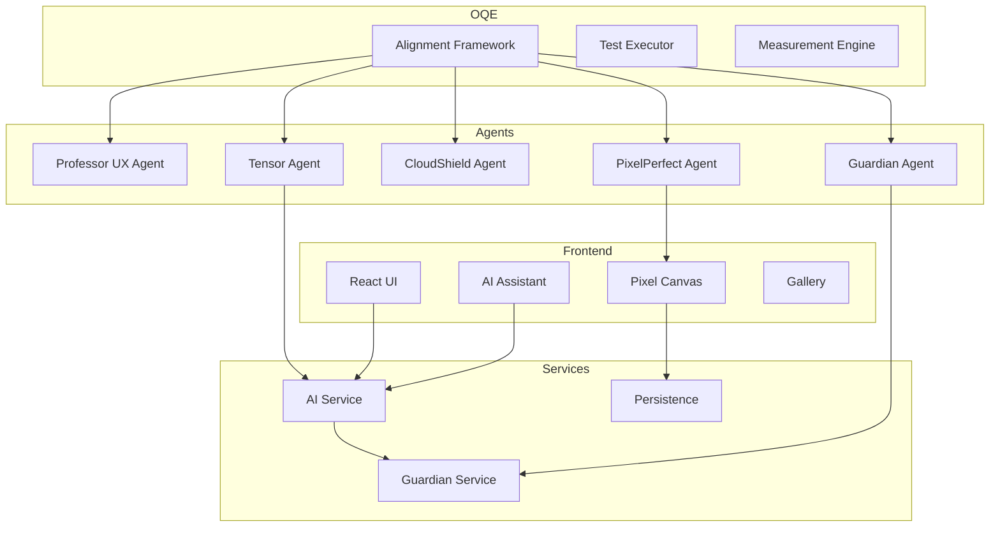

# Technical Architecture

## System Overview

Minecraft Skin Studio is built with a multi-agent quality assurance architecture that ensures safety, performance, and accessibility for child users.



## Technology Stack

### Frontend
- **Framework**: React 18 with TypeScript
- **Build Tool**: Vite
- **Styling**: CSS Modules
- **State Management**: React Hooks
- **Routing**: React Router

### AI Integration
- **Primary**: OpenAI GPT API
- **Secondary**: Anthropic Claude API
- **Safety**: Guardian Content Filter
- **Performance Target**: <3s response time

### Quality Assurance
- **Framework**: Custom OQE (Operational Quality Engineering)
- **Agents**: 5 specialized quality agents
- **Testing**: Jest, React Testing Library
- **Monitoring**: Real-time performance tracking

## Component Architecture

### Core Components

1. **PixelCanvas** (`src/components/PixelCanvas.tsx`)
   - WebGL-accelerated rendering
   - Touch and mouse input support
   - Real-time preview
   - Performance: Target 60+ FPS

2. **AIAssistant** (`src/components/AIAssistant.tsx`)
   - Chat interface for creative suggestions
   - Color palette generation
   - Safety validation via Guardian
   - Response time monitoring

3. **ColorPalette** (`src/components/ColorPalette.tsx`)
   - Predefined Minecraft colors
   - Custom color picker
   - Recent colors history
   - Accessibility: Color contrast checking

### Service Layer

1. **AIService** (`src/services/aiService.ts`)
   ```typescript
   class AIService {
     - generateSkinSuggestions()
     - generateColorPalette()
     - validateContentSafety()
     - getPerformanceMetrics()
   }
   ```

2. **Guardian Integration**
   - Content filtering
   - COPPA compliance checking
   - Safety incident monitoring
   - Real-time validation

## Data Flow

### User Input Flow
```
User Input → Guardian Validation → AI Processing → Safety Check → UI Update
```

### Skin Creation Flow
```
Canvas Draw → Pixel Data → Compression → Local Storage → Gallery Display
```

### AI Suggestion Flow
```
User Prompt → Safety Filter → AI API → Response Validation → UI Render
```

## Security Architecture

### API Security
- Environment variable management
- API key rotation
- Rate limiting (planned)
- Request signing

### Data Protection
- No personal data collection
- Local storage only
- Parent-controlled data export
- Encrypted communications

### Content Security
- Input sanitization
- XSS prevention
- Content Security Policy
- Guardian real-time filtering

## Performance Optimization

### Canvas Rendering
- **Current**: Basic 2D context
- **Target**: WebGL with requestAnimationFrame
- **Optimization**: Dirty rectangle tracking
- **Memory**: <100MB usage target

### AI Response
- Response caching
- Predictive loading
- Fallback mechanisms
- Streaming responses

### Bundle Size
- Code splitting by route
- Lazy loading components
- Tree shaking
- Target: <500KB initial load

## Accessibility Architecture

### WCAG AA Compliance
- Semantic HTML structure
- ARIA labels and roles
- Keyboard navigation
- Screen reader support

### Child-Friendly UX
- Large touch targets (44px+)
- Simple navigation
- Clear error messages
- Visual feedback

## Monitoring & Observability

### Real-time Metrics
- FPS monitoring
- AI response times
- Memory usage
- Error rates

### Agent Dashboard
```typescript
interface AgentMetrics {
  guardian: SafetyMetrics;
  pixelPerfect: PerformanceMetrics;
  cloudShield: SecurityMetrics;
  tensor: AIMetrics;
  professorUX: AccessibilityMetrics;
}
```

### Alerting
- Performance degradation
- Safety incidents
- Security threats
- Accessibility violations

## Deployment Architecture

### Development
```bash
npm run dev
# Vite dev server with HMR
# OQE agents in watch mode
```

### Staging
```bash
npm run build:staging
# Full agent verification
# Performance profiling
# Security scanning
```

### Production
```bash
npm run build
# Optimized bundle
# Agent sign-off required
# Automated rollback capability
```

## Testing Strategy

### Unit Testing
- Component isolation
- Service mocking
- Agent verification
- Coverage target: 80%

### Integration Testing
- User flows
- AI integration
- Safety validation
- Performance benchmarks

### E2E Testing
- Critical user journeys
- Cross-browser testing
- Mobile device testing
- Accessibility validation

## Future Architecture Plans

### Phase 1 (Current)
- Basic functionality
- AI integration
- Safety measures

### Phase 2
- WebGL canvas
- Multiplayer support
- Cloud sync

### Phase 3
- Mobile apps
- Offline mode
- Advanced AI features

## Scalability Considerations

### Frontend
- CDN distribution
- Service Worker caching
- Progressive enhancement
- Responsive design

### Backend (Future)
- Microservices architecture
- Container orchestration
- Auto-scaling
- Global distribution

## Compliance Architecture

### COPPA
- Age verification
- Parental consent
- Data minimization
- Access controls

### WCAG
- Automated testing
- Manual audits
- User testing
- Continuous monitoring

## Development Guidelines

### Code Standards
- TypeScript strict mode
- ESLint configuration
- Prettier formatting
- Git hooks

### Review Process
1. Code review
2. Agent verification
3. Performance check
4. Security scan
5. Accessibility test

### Documentation
- Inline code comments
- API documentation
- Architecture decisions
- User guides

---

*This architecture ensures Minecraft Skin Studio meets its vision of being the world's safest, most intuitive AI-powered creative tool for children.*