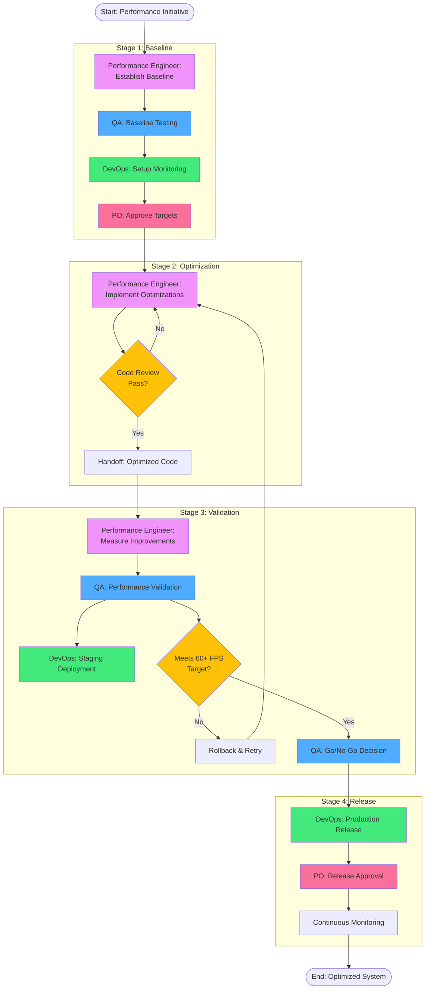
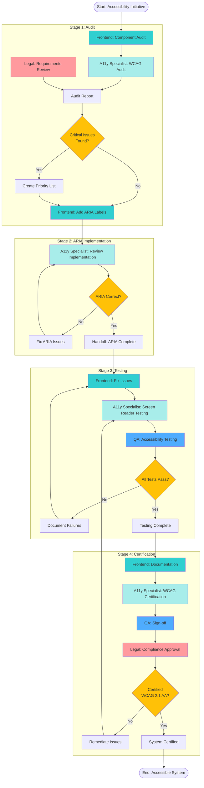
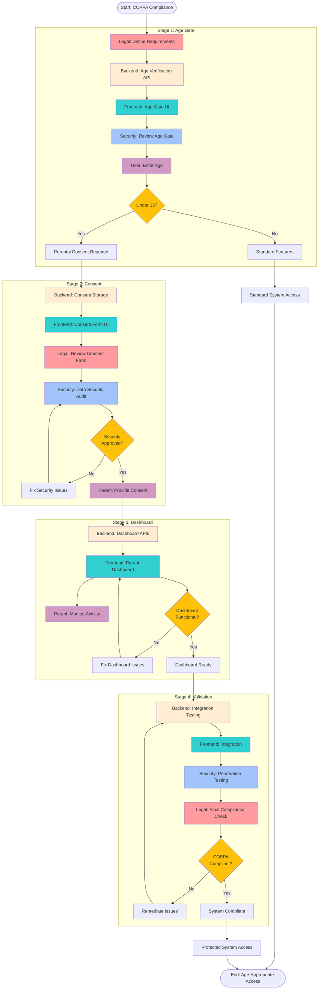

# Minecraft Skin Studio - Process Flow Diagrams

## 1. Performance Optimization Process Flow

## 2. Accessibility Implementation Flow

## 3. COPPA Compliance Flow

## Process Metrics Summary

### Performance Optimization
- **Objective**: Achieve 60+ FPS across all devices
- **Duration**: 2-3 days
- **Teams**: 4 (Performance Engineer, QA, DevOps, Product Owner)
- **Critical Gates**: 3 (Code Review, Validation, Release)
- **Success Criteria**: 
  - Average FPS ≥ 60
  - No critical performance alerts
  - All quality gates passed

### Accessibility Implementation
- **Objective**: WCAG 2.1 AA Compliance
- **Duration**: 3-5 days
- **Teams**: 4 (Frontend, A11y Specialist, QA, Legal)
- **Critical Gates**: 4 (Audit, ARIA, Testing, Certification)
- **Success Criteria**:
  - All WCAG 2.1 AA criteria met
  - Screen reader compatible
  - 100% keyboard accessible
  - Legal compliance approved

### COPPA Compliance
- **Objective**: Full COPPA compliance for users under 13
- **Duration**: 5-7 days
- **Teams**: 5 (Legal, Backend, Frontend, Security, Parents)
- **Critical Gates**: 4 (Age Verification, Consent, Dashboard, Final Validation)
- **Success Criteria**:
  - Age gate cannot be bypassed
  - Parental consent properly stored
  - Data fully encrypted
  - Security testing passed
  - Legal approval obtained

## Handoff Requirements

### Performance Optimization Handoffs
1. **Baseline → Optimization**: Baseline metrics, bottleneck analysis, approved targets
2. **Optimization → Validation**: Optimized code, change documentation, initial test results
3. **Validation → Release**: Performance test results, QA sign-off, deployment package

### Accessibility Implementation Handoffs
1. **Audit → ARIA**: Audit report, prioritized issues, implementation guidance
2. **ARIA → Testing**: ARIA-compliant code, implementation documentation
3. **Testing → Certification**: Test results, fixed issues log, compliance evidence

### COPPA Compliance Handoffs
1. **Requirements → Implementation**: Legal requirements, consent templates, guidelines
2. **Age Gate → Consent**: Age verification status, session management
3. **Consent → Dashboard**: Consent records, parent credentials, access controls
4. **Dashboard → Validation**: Complete system, integration points, test data

## Risk Mitigation Strategies

### High-Risk Points
1. **Performance**: Breaking changes during optimization
   - Mitigation: Comprehensive testing, rollback plan
   
2. **Accessibility**: Critical WCAG failures
   - Mitigation: Early audits, iterative testing
   
3. **COPPA**: Regulatory non-compliance
   - Mitigation: Legal review at each stage, security audits

### Escalation Paths
- **Technical Issues**: Dev Team → Tech Lead → Architecture Team
- **Compliance Issues**: QA → Legal → Executive Team
- **Security Issues**: Security Team → CISO → Emergency Response Team

## Validation Gates

Each process includes multiple validation gates to ensure quality:

1. **Entry Criteria**: Requirements met before stage begins
2. **Exit Criteria**: Deliverables complete and validated
3. **Quality Checks**: Automated and manual testing
4. **Approval Requirements**: Sign-offs from responsible parties
5. **Rollback Procedures**: Clear path to revert if issues found

## Communication Protocols

### Synchronous Communications
- Daily standups during active stages
- Gate review meetings
- Escalation calls for critical issues

### Asynchronous Communications
- Handoff documentation in shared repository
- Status updates in project management system
- Audit trails for all decisions

### Stakeholder Updates
- Executive dashboard with real-time metrics
- Weekly progress reports
- Post-implementation reviews